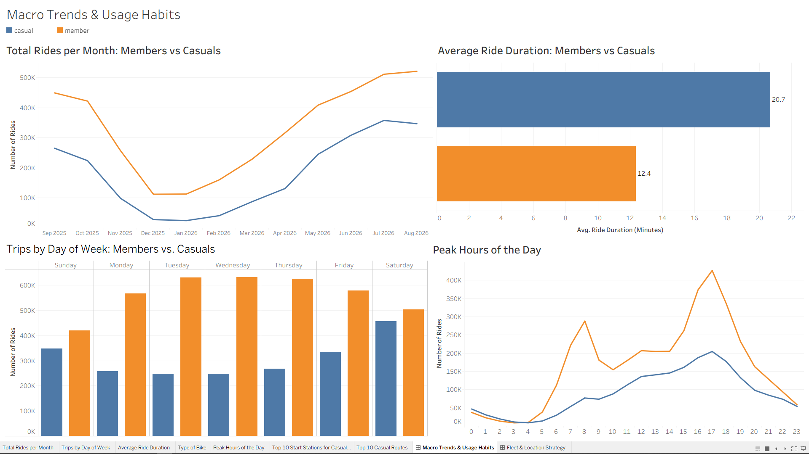
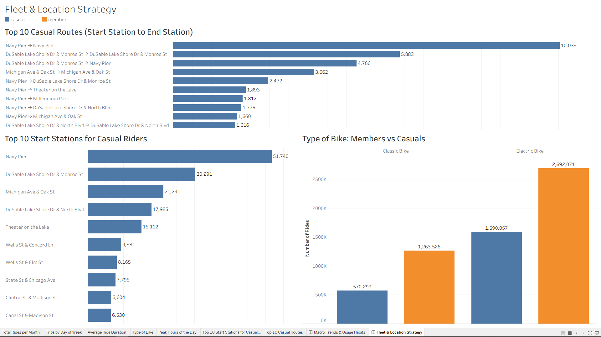

# 📊 Tableau Public Visualizations & Interactive Dashboards

## 🔗 Interactive Dashboards
👉 **[View Interactive Tableau Public Workbook](INSERT_YOUR_TABLEAU_PUBLIC_LINK_HERE)**

---

## 📌 Dashboard Architecture

The workbook consists of **7 core worksheet visual analytics** structured into **2 comprehensive executive dashboards**:

### 1. Dashboard 1: `Macro Trends & Usage Habits`
Focuses on broad behavioral differences between annual members and casual riders over time:
* **Total Rides per Month:** Tracks seasonal volume shifts from September 2025 through August 2026.
* **Trips by Day of Week:** Highlights weekend vs. weekday ride concentration per user segment.
* **Average Ride Duration:** Compares average trip duration in minutes (showing casual riders at ~20.7 mins vs. members at ~12.4 mins).
* **Peak Hours of the Day:** Details hourly commute spikes (8 AM & 5 PM peaks for members) versus casual user afternoon usage.

### 2. Dashboard 2: `Fleet & Location Strategy`
Focuses on geographical demand and hardware preferences for operational decision-making:
* **Type of Bike:** Breakdown of Classic vs. Electric bike choices across casual riders and members.
* **Top 10 Start Stations for Casual Riders:** Identifies high-traffic casual origin points (led by Navy Pier with 51,740 trips).
* **Top 10 Casual Routes (Start to End):** Maps high-frequency point-to-point journeys to target station-level marketing campaigns.

---

## 🖼️ Dashboard Previews

### Macro Trends & Usage Habits

### Fleet & Location Strategy

